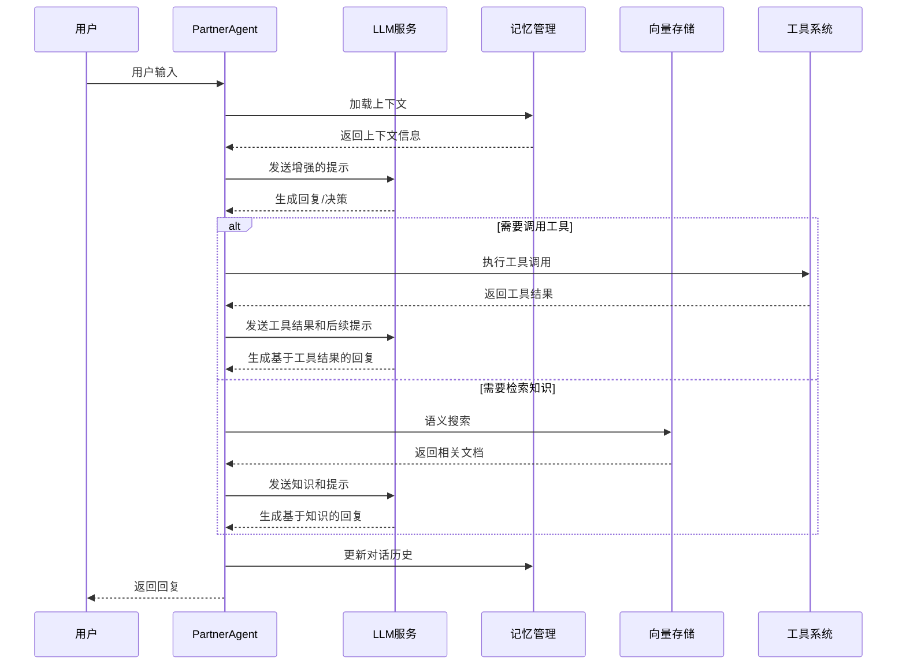
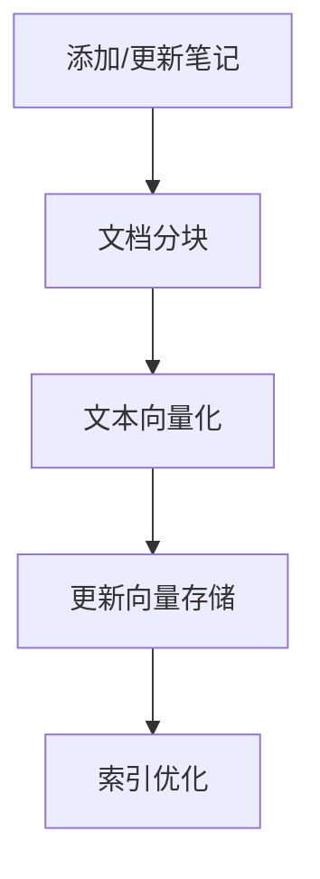

# LangGraph-Partner 项目架构

本文档详细描述了 LangGraph-Partner 项目的整体架构设计、核心模块和数据流。

## 📐 架构概览

```
┌─────────────────┐      ┌─────────────────┐      ┌─────────────────┐
│   用户交互层    │──────▶    智能体层      │──────▶    工具层      │
└────────┬────────┘      └────────┬────────┘      └────────┬────────┘
         │                       │                       │
         ▼                       ▼                       ▼
┌─────────────────┐      ┌─────────────────┐      ┌─────────────────┐
│   状态管理层    │◀─────▶    记忆管理层     │◀─────▶    存储层      │
└────────┬────────┘      └────────┬────────┘      └────────┬────────┘
         │                       │                       │
         ▼                       ▼                       ▼
┌─────────────────┐      ┌─────────────────┐      ┌─────────────────┐
│   LLM服务层     │      │    画像系统      │      │   向量存储      │
└─────────────────┘      └─────────────────┘      └─────────────────┘
```

## 🏗️ 核心组件

### 1. 智能体层 (Agents)

智能体是项目的核心执行单元，基于 LangGraph 状态图实现：

- **BasicAgent**: 基础对话智能体
  - 简单的线性对话流程
  - 状态：`{messages: List[Message]}`
  - 节点：`user_input`, `llm_response`

- **ToolsAgent**: 工具调用智能体
  - 集成工具调用的条件分支流程
  - 状态：`{messages: List[Message], tool_calls: List[Dict]}`
  - 节点：`user_input`, `tool_decision`, `execute_tool`, `generate_response`

- **PartnerAgent**: AI Partner Chat 智能体
  - 复杂的多节点状态管理
  - 状态：`{messages: List[Message], context: Dict, notes: List[Document], tool_calls: List[Dict]}`
  - 节点：`load_context`, `analyze_query`, `decide_action`, `search_notes`, `call_tools`, `generate_response`, `update_memory`

### 2. 状态管理层 (State Management)

- **LangGraph StateGraph**: 管理智能体的状态流转
  - 定义状态结构
  - 连接节点和边
  - 处理状态更新和转换

- **状态序列化/反序列化**: 处理复杂状态的持久化

### 3. 记忆管理层 (Memory Management)

- **短期记忆**: 会话级别的上下文保持
  - 基于时间窗口的消息存储
  - 对话主题跟踪

- **长期记忆**: 持久化的对话历史
  - 基于文件系统的存储
  - 按会话ID和时间戳组织

- **记忆检索**: 基于用户画像和历史交互的相关记忆检索

### 4. 画像系统 (Persona System)

- **用户画像**: 存储用户偏好、背景信息和行为模式
  - 定义：`config/user-persona.md`
  - 动态更新机制

- **AI画像**: 定义AI的性格、知识和交互风格
  - 定义：`config/ai-persona.md`
  - 角色一致性维护

### 5. 向量存储 (Vector Storage)

- **ChromaDB集成**: 本地向量数据库
  - 文档分块存储
  - 语义相似度搜索
  - 动态更新机制

- **嵌入模型**: `sentence-transformers`
  - 中文文本向量化
  - 语义特征提取

### 6. 工具层 (Tools)

- **工具接口**: 标准化的工具函数设计
  - 统一的参数验证
  - 错误处理机制
  - 结果格式化

- **内置工具**: 
  - 天气查询 (`weather.py`)
  - 数学计算 (`calculator.py`)

- **工具注册和发现机制**: 动态工具管理

### 7. LLM服务层 (LLM Services)

- **自定义LLM客户端**: `utils/llm.py`
  - 统一的API调用接口
  - 多模型支持 (智谱AI、OpenAI等)
  - 重试和错误处理

- **消息格式转换**: 适配不同模型的输入格式

## 🔄 数据流

### 1. 基础对话流程



### 2. 知识库更新流程



## ⚙️ 关键技术设计

### 1. 状态设计模式

所有智能体都遵循统一的状态设计：
- 使用 Pydantic 模型定义状态结构
- 实现状态的增量更新
- 支持状态的序列化和反序列化

```python
class AgentState(BaseModel):
    messages: List[Message] = Field(default_factory=list)
    context: Dict[str, Any] = Field(default_factory=dict)
    # 其他状态字段...
```

### 2. 节点函数设计

节点函数遵循统一的接口规范：
- 接收状态作为输入
- 执行特定的业务逻辑
- 返回更新后的状态

```python
def node_function(state: AgentState) -> AgentState:
    # 执行节点逻辑
    # 更新状态
    return updated_state
```

### 3. 错误处理策略

- **重试机制**: API调用失败自动重试
- **降级处理**: 当高级功能不可用时切换到基础功能
- **详细日志**: 记录所有关键操作和错误信息

### 4. 性能优化

- **上下文压缩**: 动态调整上下文大小
- **批处理**: 合并向量检索请求
- **缓存策略**: 缓存频繁使用的结果

## 📊 系统扩展性

### 1. 新增智能体

遵循模块化设计原则，新增智能体只需：
1. 定义状态模型
2. 实现节点函数
3. 构建状态图

### 2. 新增工具

工具系统支持无缝扩展：
1. 实现工具函数
2. 注册到工具管理器
3. 在智能体中启用

### 3. 新增存储后端

存储系统设计支持多后端：
1. 实现存储接口
2. 配置存储后端
3. 注册到存储管理器

## 📝 开发最佳实践

### 1. 架构原则

- **模块化**: 功能解耦，独立测试
- **可测试性**: 每个组件都可单独测试
- **可配置性**: 关键参数通过配置文件管理
- **可监控性**: 完整的日志和性能指标

### 2. 代码组织

- **按功能模块划分目录**
- **统一的命名规范**
- **完整的类型注解**
- **详细的文档字符串**

### 3. 部署考虑

- **环境变量配置**
- **依赖管理**
- **日志轮转**
- **资源限制**

---

本架构设计提供了一个灵活、可扩展的AI智能体开发框架，特别适合从Coze迁移的项目，既保留了快速开发的优势，又提供了更强大的自定义能力和控制精度。