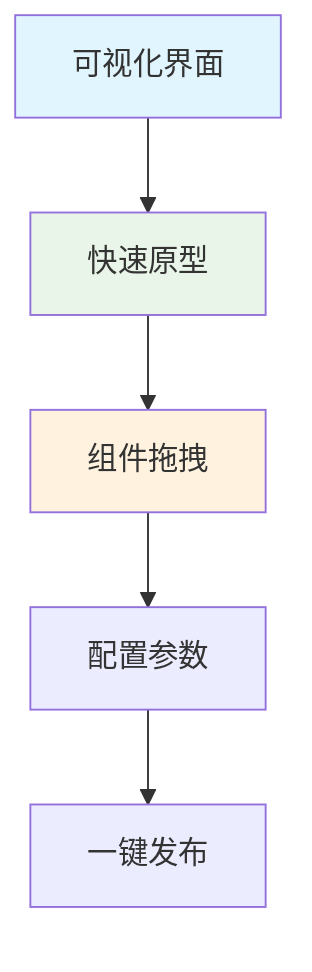
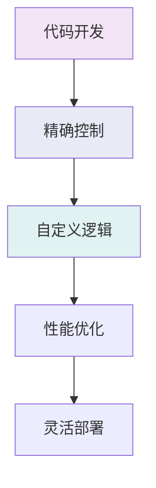

# Coze vs LangGraph 详细对比

基于你的Coze经验，这里详细对比两个平台的差异和优势。

## 核心差异对比

| 特性维度 | Coze | LangGraph |
|---------|------|-----------|
| **开发方式** | 可视化拖拽 | 纯代码开发 |
| **学习曲线** | 低，无需编程 | 中等，需要编程基础 |
| **灵活性** | 受限于平台组件 | 完全自定义 |
| **控制精度** | 粗粒度控制 | 细粒度控制 |
| **调试能力** | 基础日志 | 完整调试工具 |
| **版本控制** | 平台内置 | Git完整支持 |
| **部署选项** | 平台托管 | 自由部署 |
| **成本结构** | 按使用量付费 | 自控成本 |
| **扩展性** | 受限于平台 | 无限制 |

## 开发体验对比

### Coze优势


✅ **快速上手**：无需编程知识，拖拽即可创建
✅ **丰富组件**：内置大量现成的AI组件和模板
✅ **即时预览**：实时查看智能体效果
✅ **团队协作**：支持多人协作开发
✅ **一键发布**：快速部署到各个平台

### LangGraph优势


✅ **完全控制**：每个逻辑细节都可自定义
✅ **状态管理**：精确的复杂状态流转控制
✅ **性能优化**：可针对具体场景深度优化
✅ **测试能力**：完整的单元测试和集成测试
✅ **成本控制**：自选模型和服务，成本可控

## 实际开发场景对比

### 1. 简单对话机器人
**Coze**: 5分钟搭建
- 拖拽对话组件
- 配置基础回复
- 设置触发条件

**LangGraph**: 30分钟开发
- 编写状态图
- 配置LLM
- 实现对话逻辑

**结论**: Coze胜出，快速验证场景

### 2. 复杂业务流程
**Coze**: 受限实现
- 复杂逻辑难实现
- 状态管理有限
- 自定义能力弱

**LangGraph**: 完美实现
- 复杂状态流转
- 精确业务逻辑
- 完全自定义

**结论**: LangGraph胜出，复杂业务必需

### 3. 工具集成
**Coze**: 预置工具
- 使用平台提供的工具
- 集成第三方服务有限
- 自定义工具困难

**LangGraph**: 无限扩展
- 任何API都可集成
- 自定义工具完全控制
- 复杂数据处理

**结论**: LangGraph胜出，集成能力更强

## 迁移建议

### 从Coze到LangGraph的学习路径

1. **基础概念理解** (1-2天)
   - 状态图概念
   - 节点和边的理解
   - LangGraph基础API

2. **简单示例实践** (3-5天)
   - 复制Coze中的简单对话
   - 理解状态管理
   - 掌握基础调试

3. **工具集成学习** (1周)
   - 学习自定义工具
   - API集成实践
   - 错误处理机制

4. **高级特性掌握** (2-3周)
   - 复杂状态管理
   - 性能优化
   - 生产部署

### 何时选择Coze
- 🚀 **快速原型验证**：需要快速验证想法
- 👥 **非技术团队**：团队缺乏编程能力
- 📱 **简单对话**：基础的问答和对话需求
- 🎯 **标准场景**：使用标准组件就能满足需求

### 何时选择LangGraph
- 🔧 **复杂业务逻辑**：需要复杂的决策和状态管理
- 🏗️ **企业级应用**：需要高可靠性和可维护性
- 💰 **成本敏感**：需要严格控制成本
- 🔒 **数据安全**：需要私有化部署
- ⚡ **性能要求**：需要高度优化的性能

## 成本对比分析

### Coze成本结构
```
基础费用: $0/月
调用费用: $0.01/1000次对话
存储费用: $0.001/GB/月
带宽费用: $0.10/GB
预估月成本: $50-500 (中等使用量)
```

### LangGraph成本结构
```
开发成本: 开发者时间成本
API费用: 自选LLM成本 (OpenAI/本地模型)
服务器: $5-100/月 (根据规模)
监控: $10-50/月
预估月成本: $20-200 (自建中小规模)
```

## 总结建议

基于你的Coze经验，我建议：

1. **保持Coze技能**：用于快速原型和简单项目
2. **学习LangGraph**：用于复杂和长期项目
3. **混合使用**：根据项目特点选择合适工具
4. **团队分工**：非技术人员用Coze，技术人员用LangGraph

这样既能发挥Coze的快速开发优势，又能利用LangGraph的强大能力。