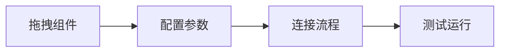
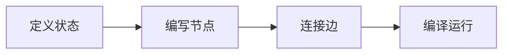

# LangGraph 快速上手指南

欢迎从Coze转向LangGraph！这个指南将帮助你快速掌握LangGraph的核心概念。

## 🎯 学习目标

通过这个项目，你将学会：
- LangGraph的核心概念和架构
- 如何创建和配置智能体
- 如何添加自定义工具
- 状态管理和流程控制
- 调试和测试方法

## 📁 项目结构说明

```
LangGraph/
├── utils/llm.py          # LLM配置管理
├── agents/               # 智能体实现
│   ├── basic_agent.py    # 基础对话智能体
│   └── tools_agent.py    # 带工具的智能体
├── tools/                # 自定义工具
│   ├── weather.py        # 天气查询工具
│   └── calculator.py     # 计算器工具
├── examples/             # 使用示例
│   ├── basic_usage.py    # 基础示例
│   └── tools_demo.py     # 工具示例
└── Coze_vs_LangGraph.md  # 详细对比分析
```

## 🚀 快速开始

### 1. 安装依赖
```bash
pip install -r requirements.txt
```

### 2. 配置API
编辑 `.env.local` 文件，配置你的API密钥：
```
AI_CLAUDE_BASE_URL="你的API地址"
AI_CLAUDE_API_KEY="你的API密钥"
ANTHROPIC_MODEL="模型名称"
```

### 3. 运行示例

**基础对话智能体**：
```bash
python examples/basic_usage.py
```

**工具调用智能体**：
```bash
python examples/tools_demo.py
```

## 🧠 核心概念理解

### 1. 状态图 (State Graph)
LangGraph使用有向图来表示智能体的决策流程：
- **节点 (Nodes)**：执行具体操作
- **边 (Edges)**：定义节点之间的转换
- **状态 (State)**：在节点间传递的数据

### 2. 智能体工作流
```
用户输入 → 状态更新 → 决策节点 → 工具调用/直接回复 → 输出结果
```

### 3. 工具调用机制
- 定义工具函数
- LLM决定是否使用工具
- 执行工具并处理结果
- 将结果返回给用户

## 💡 从Coze到LangGraph的思维转变

### Coze思维


### LangGraph思维


## 🎯 实践建议

### 1. 从简单开始
- 先理解基础对话智能体
- 掌握状态图的基本概念
- 学会基本的调试方法

### 2. 逐步增加复杂性
- 添加工具调用
- 实现复杂的状态管理
- 优化性能和错误处理

### 3. 实战项目建议
- 复制你在Coze中的项目到LangGraph
- 尝试实现更复杂的业务逻辑
- 探索LangGraph的高级特性

## 🛠️ 开发最佳实践

### 代码组织
- 将工具函数放在 `tools/` 目录
- 智能体逻辑放在 `agents/` 目录
- 使用 `utils/` 管理配置

### 调试技巧
- 使用 `verbose=True` 查看详细日志
- 在每个节点添加状态打印
- 单独测试工具函数

### 错误处理
- 为每个工具添加异常处理
- 设置合理的超时时间
- 实现优雅的降级机制

## 📚 学习资源

### 官方文档
- [LangGraph Documentation](https://python.langchain.com/docs/langgraph)
- [LangChain Documentation](https://python.langchain.com/docs/)

### 进阶主题
- 复杂状态管理
- 异步执行
- 自定义执行器
- 生产部署

## 🤝 下一步

1. **完成基础示例**：运行并理解项目中的示例代码
2. **创建自己的智能体**：基于示例创建自己的智能体
3. **集成外部API**：添加你需要的第三方服务
4. **性能优化**：学习如何优化智能体的响应速度

## 🎉 恭喜！

你现在具备了使用LangGraph开发AI智能体的基础知识！结合你的Coze经验，你将能够创建出更强大、更灵活的AI应用。

记住：**Coze适合快速验证，LangGraph适合深度开发**。选择合适的工具，让你的AI项目更上一层楼！