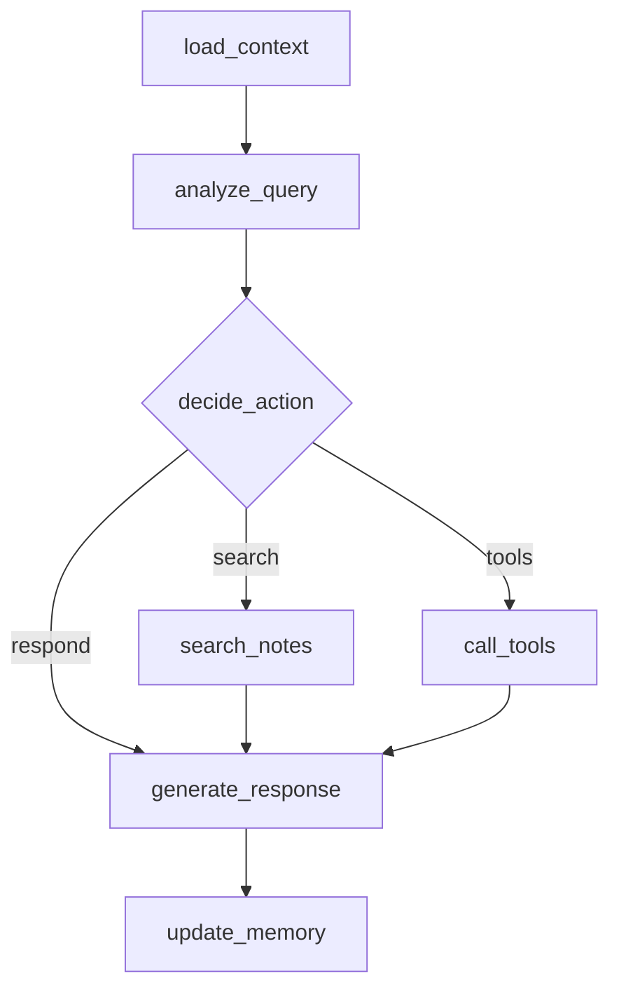

# LangGraph-Partner


## 🌟 项目特色

### 🤖 AI Partner Chat 系统
- **个性化对话**: 基于用户画像和历史笔记的智能交互
- **记忆管理**: 多会话上下文保持和长期记忆
- **向量化检索**: 语义搜索相关知识库内容
- **状态图架构**: 基于 LangGraph 的智能状态管理

## 📁 项目结构

```
LangGraph/
├── agents/                    # 智能体实现
│   ├── basic_agent.py         # 基础对话智能体
│   ├── tools_agent.py         # 工具调用智能体
│   └── partner_agent.py       # AI Partner Chat 智能体 (🆕)
├── tools/                     # 自定义工具
│   ├── weather.py             # 天气查询工具
│   └── calculator.py          # 数学计算工具
├── utils/                     # 工具函数
│   ├── llm.py                 # LLM配置管理
│   ├── vector_store.py        # 向量化存储系统 (🆕)
│   ├── persona_manager.py     # 画像管理系统 (🆕)
│   └── memory_manager.py      # 对话记忆管理 (🆕)
├── config/                    # 配置文件 (🆕)
│   ├── user-persona.md        # 用户画像定义
│   └── ai-persona.md          # AI画像定义
├── scripts/                   # 脚本工具 (🆕)
│   └── chunk_and_index.py     # 智能笔记分块和索引
├── examples/                  # 示例代码
│   ├── basic_usage.py         # 基础使用示例
│   ├── tools_demo.py          # 工具演示示例
│   ├── partner_chat_demo.py   # AI Partner 完整演示 (🆕)
│   ├── memory_demo.py         # 记忆功能演示 (🆕)
│   ├── multi_session_demo.py  # 多会话演示 (🆕)
│   └── quick_start.py         # 快速启动指南 (🆕)
├── notes/                     # 用户笔记目录 (🆕)
├── vector_db/                 # 向量数据库存储 (🆕)
├── memory/                    # 对话记忆存储 (🆕)
└── requirements.txt           # 依赖包
```

## 🚀 快速开始

### 1. 环境配置

#### 前置要求
- Python 3.8 或更高版本
- pip 包管理工具
- Git（可选，用于克隆仓库）

#### 安装步骤
```bash
# 克隆仓库（可选）
git clone https://github.com/hhhh124hhh/LangGraph-Partner.git
cd LangGraph-Partner

# 配置环境变量
# 1. 复制环境变量示例文件
cp .env.example .env

# 2. 编辑.env文件，填入实际的API密钥
# ZHIPU_API_KEY=your_zhipu_api_key_here
# ZHIPU_BASE_URL=https://open.bigmodel.cn/api/paas/v4
# DEFAULT_MODEL=glm-4.6

# 3. 或者直接设置环境变量
# Linux/Mac:
export ZHIPU_API_KEY=your_zhipu_api_key_here

# Windows命令行:
set ZHIPU_API_KEY=your_zhipu_api_key_here

# Windows PowerShell:
$env:ZHIPU_API_KEY="your_zhipu_api_key_here"

# 安装依赖
pip install -r requirements.txt
```

### 2. 一键启动
```bash
# 运行快速启动脚本（推荐）
python examples/quick_start.py
```

### 3. 完整演示
```bash
# AI Partner 完整功能演示
python examples/partner_chat_demo.py

# 记忆功能专项演示
python examples/memory_demo.py

# 多会话上下文演示
python examples/multi_session_demo.py
```

## 🎯 AI Partner Chat 核心功能

### 个性化画像系统
- **用户画像**: 定义背景、兴趣、沟通风格
- **AI画像**: 设置角色、回应方式、交互指南
- **动态更新**: 根据对话历史优化画像

### 智能记忆管理
- **短期记忆**: 当前对话的上下文保持
- **长期记忆**: 跨会话的知识积累
- **语义搜索**: 基于向量化的智能检索

### 向量化知识库
- **智能分块**: AI驱动的笔记分析最优分块
- **语义检索**: 找到最相关的历史信息
- **动态索引**: 支持实时添加和更新笔记

## 📊 LangGraph vs Coze 对比

| 特性维度 | Coze | LangGraph + AI Partner |
|---------|------|-----------------------|
| **开发方式** | 可视化拖拽 | 代码化开发 + AI辅助 |
| **个性化程度** | 基础配置 | 深度个性化画像 |
| **记忆能力** | 会话级别 | 多层次记忆系统 |
| **知识检索** | 关键词匹配 | 语义向量化检索 |
| **上下文感知** | 有限 | 跨会话上下文保持 |
| **扩展性** | 平台限制 | 完全自定义 |
| **调试能力** | 基础日志 | 完整调试和分析 |

## 🛠️ 自定义配置

### 1. 自定义画像
编辑 `config/user-persona.md` 和 `config/ai-persona.md`：

```markdown
# 用户画像示例
## Basic Information
- **Name**: 你的名字
- **Role**: 你的职业角色
- **Communication Style**: 偏好的沟通方式

## Interests & Expertise
- **Primary Interests**: 主要兴趣领域
- **Technical Skills**: 技术技能
```

### 2. 添加知识笔记
在 `notes/` 目录添加 Markdown 文件：

```bash
# 添加项目笔记
echo "# 我的项目\n\n项目描述和关键信息..." > notes/my_project.md

# 添加学习笔记
echo "# 学习笔记\n\n重要概念和心得..." > notes/learning_notes.md
```

### 3. 重新索引知识
```bash
python scripts/chunk_and_index.py
```

## 🔧 技术架构

### 核心组件
1. **PartnerAgent**: 主智能体，协调所有组件
2. **VectorStore**: ChromaDB 向量存储
3. **PersonaManager**: 画像管理系统
4. **MemoryManager**: 记忆管理系统

### 状态图设计


## 📱 使用场景

### 1. 学习伙伴
- 跟踪学习进度
- 提供个性化建议
- 关联相关知识

### 2. 项目助手
- 项目知识管理
- 上下文感知对话
- 智能问题解答

### 3. 研究伙伴
- 文献知识整合
- 跨会话思路延续
- 个性化研究建议

## 🤝 贡献指南

我们非常欢迎社区贡献！请按照以下步骤参与：

1. Fork 项目到你的 GitHub 账号
2. 创建一个功能分支：`git checkout -b feature/amazing-feature`
3. 提交你的更改：`git commit -m 'Add some amazing feature'`
4. 推送到分支：`git push origin feature/amazing-feature`
5. 打开一个 Pull Request

请确保你的代码符合项目的代码风格，并通过所有测试。

## 📄 许可证

本项目采用 MIT 许可证 - 详情请查看 [LICENSE](LICENSE) 文件

## 🌟 致谢

感谢以下项目和社区的支持：

- [AI Partner Chat](https://github.com/eze-is/ai-partner-chat) - 提供了核心对话伙伴功能的灵感和参考
- [LangChain](https://python.langchain.com/) - 强大的LLM开发框架
- [LangGraph](https://langchain-ai.github.io/langgraph/) - 有状态的AI应用框架

## 🆘 支持与社区

- 📖 查看示例代码学习使用方法
- 🔧 阅读 `.claude/ai-partner-chat/SKILL.md` 了解技术细节
- 🧠 查看 `.claude/langgraph-development` 获取完整的 LangGraph 学习环境和教程
- 🐛 在 GitHub Issues 中报告问题或提出功能请求
- 💬 加入我们的社区讨论（待添加）

## 📈 版本信息

### 当前版本: v0.1.0

- 初始发布版本
- 包含完整的 AI Partner Chat 功能
- 支持个性化画像、多层次记忆和向量化知识库
- 集成了完整的 LangGraph 学习环境

## 🧠 LangGraph 学习环境

项目内置了完整的 LangGraph 学习和开发环境（位于 `.claude/langgraph-development`），专为初学者设计：

- 🚀 开包即用，一键启动学习环境
- 🎓 渐进式学习路径，从基础到高级
- 📚 丰富的教程、示例和文档
- 🛠️ 完整的开发工具链

通过运行 `python .claude/langgraph-development/start.py` 开始你的 LangGraph 学习之旅！