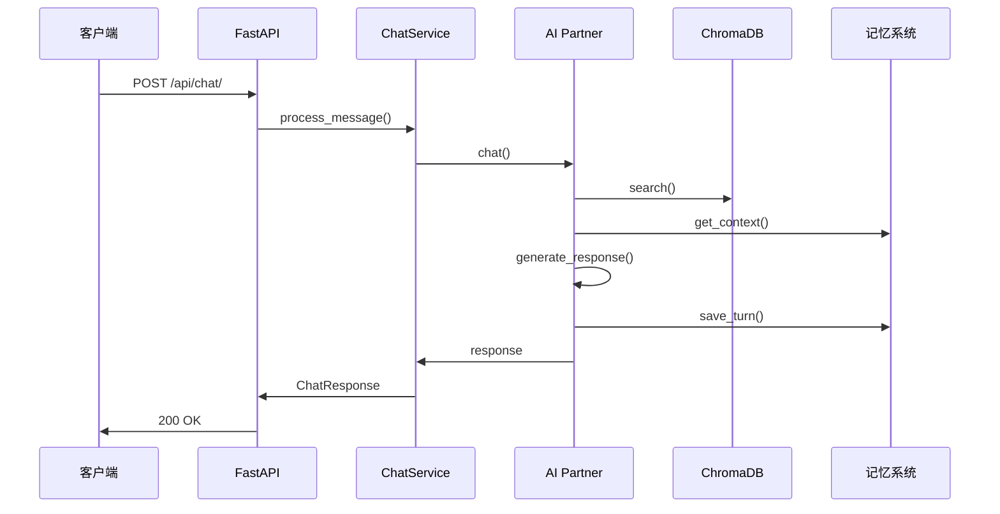
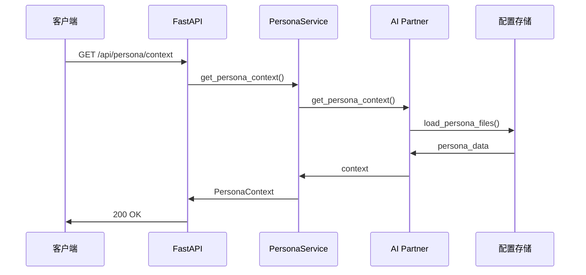

# AI Partner API 架构文档

## 系统概述

AI Partner API 是一个基于 FastAPI 构建的现代化后端服务，提供完整的 AI 智能体对话系统。系统采用分层架构设计，集成了现有的 AI Partner 智能体代码，提供了高性能、可扩展的 RESTful API。

## 架构设计

### 整体架构

```
┌─────────────────────────────────────────────────────────────┐
│                    客户端应用                                 │
├─────────────────────────────────────────────────────────────┤
│                    API网关层                                 │
│  ┌─────────────┬─────────────┬─────────────┬─────────────┐   │
│  │   CORS      │  请求日志    │  错误处理    │  安全验证    │   │
│  └─────────────┴─────────────┴─────────────┴─────────────┘   │
├─────────────────────────────────────────────────────────────┤
│                    FastAPI应用层                             │
│  ┌─────────────────────────────────────────────────────────┐ │
│  │              路由层 (API层)                             │ │
│  │  chat.py  persona.py  memory.py  knowledge.py  demo.py  │ │
│  └─────────────────────────────────────────────────────────┘ │
│  ┌─────────────────────────────────────────────────────────┐ │
│  │              服务层 (Services)                          │ │
│  │  chat_service.py  persona_service.py  demo_service.py  │ │
│  └─────────────────────────────────────────────────────────┘ │
│  ┌─────────────────────────────────────────────────────────┐ │
│  │              模型层 (Models)                            │ │
│  │  chat.py  persona.py  response.py                      │ │
│  └─────────────────────────────────────────────────────────┘ │
├─────────────────────────────────────────────────────────────┤
│                    核心业务层                                │
│  ┌─────────────────────────────────────────────────────────┐ │
│  │            AI Partner 集成层                            │ │
│  │  utils/ai_partner.py                                  │ │
│  └─────────────────────────────────────────────────────────┘ │
│  ┌─────────────────────────────────────────────────────────┐ │
│  │            现有组件层                                   │ │
│  │  agents/  utils/  tools/                              │ │
│  └─────────────────────────────────────────────────────────┘ │
├─────────────────────────────────────────────────────────────┤
│                    数据存储层                                │
│  ┌─────────────┬─────────────┬─────────────┬─────────────┐   │
│  │ ChromaDB    │   文件存储    │   配置管理    │   缓存      │   │
│  │ (向量数据库) │  (记忆数据)   │  (画像数据)   │  (会话)    │   │
│  └─────────────┴─────────────┴─────────────┴─────────────┘   │
└─────────────────────────────────────────────────────────────┘
```

### 技术栈

- **Web框架**: FastAPI 0.104.1
- **ASGI服务器**: Uvicorn
- **数据验证**: Pydantic v2
- **异步支持**: asyncio, aiofiles
- **向量数据库**: ChromaDB
- **嵌入模型**: Sentence Transformers (BAAI/bge-m3)
- **AI模型**: 智谱AI (glm-4.6)
- **智能体框架**: LangGraph

## 核心组件

### 1. FastAPI应用层 (`app/main.py`)

**职责**:
- 应用生命周期管理
- 中间件配置 (CORS, 安全, 日志)
- 异常处理器注册
- 路由注册
- 文档生成

**关键特性**:
- 自动API文档生成 (Swagger/OpenAPI)
- 异步请求处理
- 请求/响应验证
- 优雅的错误处理

### 2. API路由层 (`app/api/`)

**职责**:
- HTTP请求处理
- 参数验证
- 响应格式化
- 业务逻辑调用

**模块结构**:
```
api/
├── chat.py       # 对话相关API
├── persona.py    # 画像管理API
├── memory.py     # 记忆管理API
├── knowledge.py  # 知识检索API
└── demo.py       # 演示功能API
```

### 3. 服务层 (`app/services/`)

**职责**:
- 业务逻辑实现
- 组件协调
- 数据转换
- 错误处理

**服务类型**:
- **ChatService**: 对话处理逻辑
- **PersonaService**: 画像管理业务
- **DemoService**: 演示功能实现

### 4. 数据模型层 (`app/models/`)

**职责**:
- 数据结构定义
- 请求/响应模型
- 数据验证规则
- 序列化/反序列化

**模型分类**:
- **chat.py**: 对话相关模型
- **persona.py**: 画像相关模型
- **response.py**: 通用响应模型

### 5. AI Partner集成层 (`app/utils/ai_partner.py`)

**职责**:
- 现有代码封装
- 服务初始化
- 错误恢复
- 模拟模式支持

**集成策略**:
- 动态导入现有模块
- 优雅降级机制
- 配置驱动初始化

## 数据流架构

### 对话处理流程



### 画像管理流程



## 核心特性设计

### 1. 异步处理架构

**设计原则**:
- 所有I/O操作使用async/await
- 支持并发请求处理
- 非阻塞数据库操作
- 流式响应支持

**实现示例**:
```python
@app.post("/api/chat/")
async def chat(request: ChatRequest):
    # 异步消息处理
    response = await chat_service.process_message(request)
    return response
```

### 2. 错误处理机制

**分层错误处理**:
1. **模型层**: Pydantic验证错误
2. **服务层**: 业务逻辑错误
3. **API层**: HTTP错误响应
4. **全局层**: 未捕获异常处理

**错误分类**:
- **ValidationError**: 数据验证错误
- **AIServiceError**: AI服务错误
- **MemoryError**: 记忆系统错误
- **VectorStoreError**: 向量存储错误

### 3. 安全性设计

**安全措施**:
- **输入验证**: 严格的参数验证
- **CORS支持**: 跨域请求控制
- **速率限制**: 防止API滥用
- **内容清理**: 敏感信息过滤
- **文件安全**: 文件名和类型验证

### 4. 可观测性

**监控能力**:
- **结构化日志**: JSON格式日志
- **请求追踪**: 请求ID和耗时
- **健康检查**: 服务状态监控
- **性能指标**: 处理时间统计

## 扩展性设计

### 1. 水平扩展

**无状态设计**:
- 会话状态外部化
- 数据库连接池
- 缓存层分离
- 负载均衡支持

### 2. 功能扩展

**插件化架构**:
- 工具系统扩展
- 画像插件机制
- 自定义中间件
- 事件驱动架构

### 3. 部署扩展

**多环境支持**:
- 开发环境配置
- 测试环境部署
- 生产环境优化
- 容器化支持

## 性能优化

### 1. 缓存策略

**多级缓存**:
- 应用内存缓存
- Redis分布式缓存
- 数据库查询缓存
- 静态资源缓存

### 2. 数据库优化

**ChromaDB优化**:
- 索引优化
- 批量操作
- 连接池管理
- 查询缓存

### 3. 异步优化

**并发控制**:
- 连接池大小调优
- 超时时间配置
- 背压处理
- 资源限制

## 部署架构

### 开发环境

```yaml
开发环境:
  - 直接运行: python -m app.main
  - 热重载: --reload
  - 调试模式: API_DEBUG=true
  - 详细日志: LOG_LEVEL=DEBUG
```

### 生产环境

```yaml
生产环境:
  - 容器化: Docker + Docker Compose
  - 反向代理: Nginx
  - 进程管理: Gunicorn
  - 监控: 健康检查 + 日志收集
  - 负载均衡: 多实例部署
```

## 未来规划

### 短期优化

1. **性能优化**:
   - 添加Redis缓存
   - 数据库查询优化
   - 异步操作优化

2. **功能增强**:
   - WebSocket支持
   - 流式响应
   - 批量操作API

### 中期扩展

1. **微服务化**:
   - 服务拆分
   - API网关
   - 服务发现

2. **智能化**:
   - 自适应学习
   - 个性化推荐
   - 智能路由

### 长期发展

1. **企业级特性**:
   - 多租户支持
   - 权限管理
   - 审计日志

2. **AI能力增强**:
   - 多模型支持
   - 模型热切换
   - 性能监控

## 总结

AI Partner API 采用现代化的分层架构设计，通过 FastAPI 提供高性能的异步处理能力，完整集成了现有的 AI Partner 智能体代码。系统具有良好的可扩展性、可维护性和安全性，为构建企业级AI应用提供了坚实的基础。

通过清晰的模块划分和标准化的接口设计，系统能够快速响应业务需求变化，支持灵活的功能扩展和性能优化。