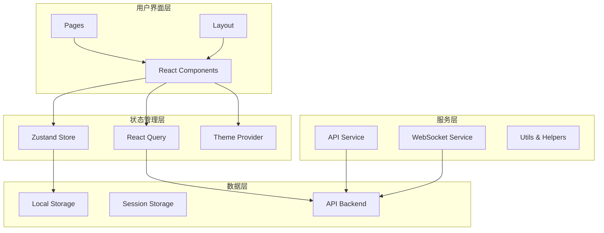
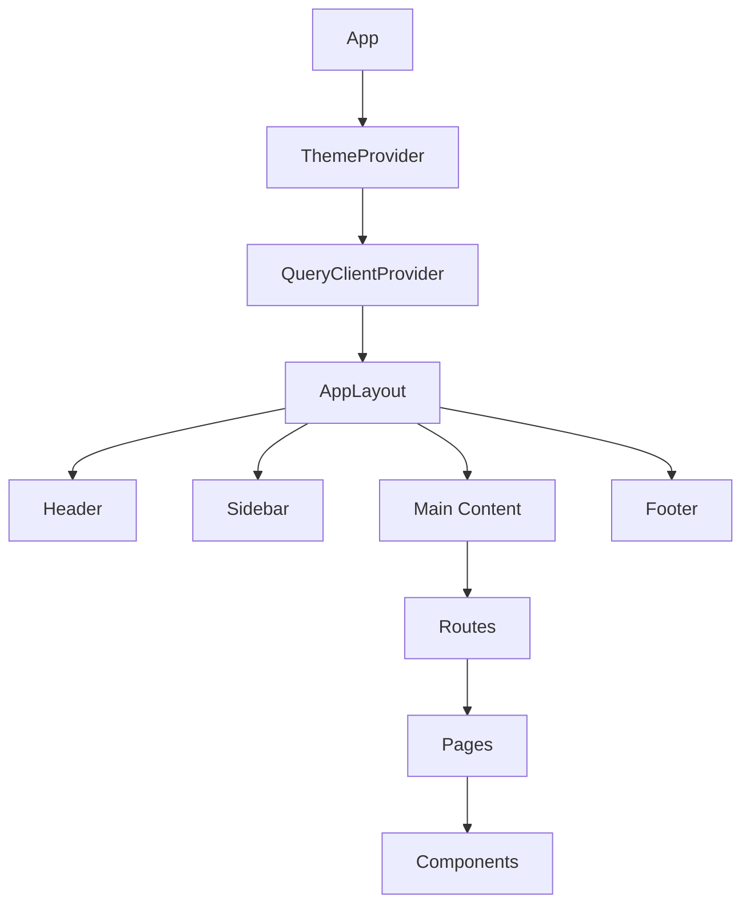
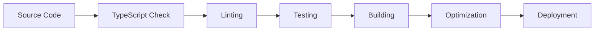

# AI Partner Frontend Architecture

## 系统架构概览

AI Partner前端采用现代化的React架构，结合了最新的前端技术和最佳实践，构建高性能、可维护的Web应用。



## 技术栈详解

### 核心框架
- **React 18**: 采用最新的并发特性和Hooks
- **TypeScript**: 提供完整的类型安全
- **Vite**: 快速的开发构建工具

### 状态管理
- **Zustand**: 轻量级状态管理解决方案
- **React Query**: 服务端状态管理和缓存
- **Context API**: 主题和全局配置管理

### 样式系统
- **Tailwind CSS**: 实用优先的CSS框架
- **CSS-in-JS**: 动态样式和主题切换
- **Responsive Design**: 移动优先的设计原则

### 数据可视化
- **D3.js**: 强大的数据可视化库
- **Recharts**: React图表组件库
- **Canvas API**: 高性能图形渲染

## 目录结构

```
src/
├── components/              # 可复用组件
│   ├── Layout/             # 布局组件
│   │   ├── AppLayout.tsx   # 主布局
│   │   ├── Header.tsx      # 顶部导航
│   │   ├── Sidebar.tsx     # 侧边栏
│   │   └── Footer.tsx      # 底部
│   ├── Chat/               # 对话组件
│   ├── Visualization/      # 可视化组件
│   ├── Comparison/         # 对比分析组件
│   └── Demo/               # 演示组件
├── pages/                  # 页面组件
│   ├── HomePage.tsx        # 首页
│   ├── ChatPage.tsx        # 对话页
│   ├── VisualizationPage.tsx # 可视化页
│   ├── ComparisonPage.tsx  # 对比页
│   ├── DemoPage.tsx        # 演示页
│   └── SettingsPage.tsx    # 设置页
├── hooks/                  # 自定义Hooks
│   ├── useQueryClient.ts   # Query客户端
│   ├── useApiQuery.ts      # API查询Hooks
│   └── useWebSocket.ts     # WebSocket Hooks
├── services/               # API服务
│   ├── api.ts              # HTTP客户端
│   ├── websocket.ts        # WebSocket服务
│   └── index.ts            # 服务导出
├── stores/                 # 状态管理
│   ├── useAppStore.ts      # 应用全局状态
│   ├── useChatStore.ts     # 对话状态
│   └── index.ts            # Store导出
├── utils/                  # 工具函数
│   ├── helpers.ts          # 通用工具
│   └── index.ts            # 工具导出
├── types/                  # 类型定义
│   └── index.ts            # 主要类型
└── styles/                 # 样式文件
    └── globals.css         # 全局样式
```

## 组件架构

### 组件层次结构



### 组件设计原则

1. **单一职责**: 每个组件只负责一个功能
2. **组合优于继承**: 使用组件组合构建复杂UI
3. **Props接口**: 使用TypeScript定义清晰的Props接口
4. **状态提升**: 状态尽可能靠近使用者
5. **可测试性**: 组件易于单元测试

## 状态管理架构

### Zustand Store设计

```typescript
// 应用全局状态
interface AppState {
  theme: 'light' | 'dark' | 'system';
  sidebar_open: boolean;
  notifications: Notification[];
  user: User | null;
  settings: AppSettings;
}

// 对话状态
interface ChatState {
  sessions: ChatSession[];
  currentSessionId: string | null;
  isLoading: boolean;
  inputMessage: string;
}
```

### React Query配置

```typescript
// 查询键工厂
export const queryKeys = {
  chatState: (sessionId: string) => ['chat', 'state', sessionId],
  memoryNetwork: (sessionId: string) => ['memory', 'network', sessionId],
  demoScenarios: () => ['demo', 'scenarios'],
};

// 查询Hooks
export const useChatStateQuery = (sessionId: string) => {
  return useQuery({
    queryKey: queryKeys.chatState(sessionId),
    queryFn: () => apiService.getChatState(sessionId),
    enabled: !!sessionId,
  });
};
```

## API架构

### HTTP服务层

```typescript
class ApiService {
  private client: AxiosInstance;

  constructor() {
    this.client = axios.create({
      baseURL: process.env.VITE_API_BASE_URL,
      timeout: 30000,
    });
    this.setupInterceptors();
  }

  // API方法
  async sendMessage(request: ChatRequest): Promise<ChatResponse> {
    return this.client.post('/chat/', request);
  }
}
```

### WebSocket服务

```typescript
class WebSocketService {
  private ws: WebSocket | null = null;
  private eventHandlers: Map<string, Set<Function>> = new Map();

  connect(url?: string): Promise<void> {
    // WebSocket连接逻辑
  }

  on(eventType: string, handler: Function): () => void {
    // 事件监听器注册
  }
}
```

## 样式架构

### Tailwind CSS配置

```javascript
// tailwind.config.js
export default {
  theme: {
    extend: {
      colors: {
        primary: { /* 自定义主色调 */ },
        secondary: { /* 自定义辅助色 */ },
      },
      fontFamily: {
        sans: ['Inter', 'system-ui'],
        mono: ['JetBrains Mono', 'monospace'],
      },
    },
  },
  darkMode: 'class',
};
```

### 组件样式策略

1. **实用优先**: 使用Tailwind实用类
2. **组件变体**: 使用clsx和tailwind-merge
3. **响应式设计**: 移动优先原则
4. **主题支持**: 明暗主题切换

## 性能优化策略

### 代码分割

```typescript
// 路由级别代码分割
const ChatPage = lazy(() => import('./pages/ChatPage'));
const VisualizationPage = lazy(() => import('./pages/VisualizationPage'));

// 组件级别代码分割
const HeavyChart = lazy(() => import('./components/HeavyChart'));
```

### 缓存策略

```typescript
// React Query缓存配置
const queryClient = new QueryClient({
  defaultOptions: {
    queries: {
      staleTime: 5 * 60 * 1000, // 5分钟
      cacheTime: 10 * 60 * 1000, // 10分钟
    },
  },
});
```

### Bundle优化

```typescript
// vite.config.ts
export default defineConfig({
  build: {
    rollupOptions: {
      output: {
        manualChunks: {
          vendor: ['react', 'react-dom'],
          ui: ['@headlessui/react', '@heroicons/react'],
          charts: ['recharts', 'd3'],
        },
      },
    },
  },
});
```

## 测试架构

### 测试策略

1. **单元测试**: Jest + React Testing Library
2. **集成测试**: API和组件集成测试
3. **E2E测试**: Playwright端到端测试
4. **性能测试**: Lighthouse和Web Vitals

### 测试文件结构

```
src/
├── __tests__/              # 测试文件
│   ├── components/         # 组件测试
│   ├── hooks/             # Hooks测试
│   ├── services/          # 服务测试
│   └── utils/             # 工具函数测试
├── __mocks__/             # Mock文件
└── setupTests.ts          # 测试配置
```

## 安全架构

### 安全措施

1. **输入验证**: 客户端和服务端双重验证
2. **XSS防护**: 内容安全策略和输入转义
3. **CSRF防护**: Token验证
4. **敏感信息**: 环境变量管理

### 环境配置

```bash
# .env.example
VITE_API_BASE_URL=http://localhost:8000/api
VITE_WS_URL=ws://localhost:8000/ws
VITE_ENABLE_ANALYTICS=false
```

## 部署架构

### 构建流程



### Docker部署

```dockerfile
# 多阶段构建
FROM node:18-alpine as builder
WORKDIR /app
COPY package*.json ./
RUN npm ci
COPY . .
RUN npm run build

FROM nginx:alpine
COPY --from=builder /app/dist /usr/share/nginx/html
COPY nginx.conf /etc/nginx/nginx.conf
```

## 监控和调试

### 开发工具

1. **React DevTools**: 组件调试
2. **Redux DevTools**: 状态调试（Zustand支持）
3. **React Query Devtools**: API调试
4. **Lighthouse**: 性能分析

### 错误处理

```typescript
// 错误边界
class ErrorBoundary extends React.Component {
  componentDidCatch(error: Error, errorInfo: React.ErrorInfo) {
    // 错误报告逻辑
    console.error('应用错误:', error, errorInfo);
  }
}

// 全局错误处理
window.addEventListener('error', (event) => {
  // 错误监控
});
```

## 未来架构演进

### 微前端架构

```typescript
// 模块联邦配置
module.exports = {
  plugins: [
    new ModuleFederationPlugin({
      name: 'aipartner',
      remotes: {
        chat: 'chat@http://localhost:3001/remoteEntry.js',
        visualization: 'visualization@http://localhost:3002/remoteEntry.js',
      },
    }),
  ],
};
```

### 服务端渲染（SSR）

```typescript
// Next.js迁移计划
// 保持现有组件架构
// 添加SSR支持
// SEO优化
```

---

这份架构文档将随着项目的发展持续更新和完善。